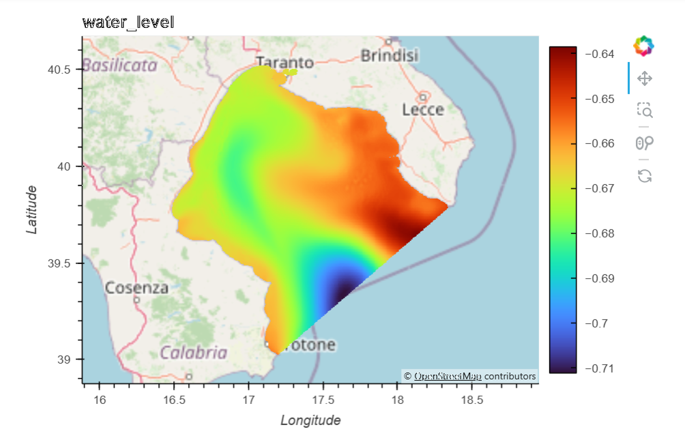

# Cloud School, Fall 2025

Notebooks for the 2025 Cloud Fall School in Bologna @ CMCC (Oct 13-17, 2025)

We used the [Pangeo@EOSC JupyterHub](https://pangeo-eosc.vm.fedcloud.eu/) with Dask Gateway and S3-compatible storage, selecting the `quay.io/globalcoast/protocoast-notebook:main` image for our server. 

